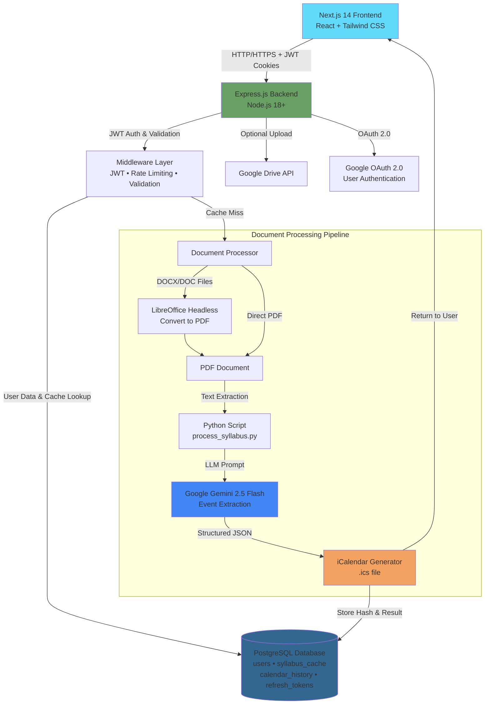

# AggieAce


**AggieAce** is an intelligent syllabus-to-calendar conversion platform that saves students 10+ hours per semester by automatically extracting events, assignments, and deadlines from unstructured PDF/DOCX syllabi using LLM-powered extraction with SHA-256 hash-based caching.

---

### Project Status & Architecture Note
**Current Release: Production Infrastructure & Core Pipeline**

This repository demonstrates a full-stack application developed for Texas A&M University students. The application has:
- Complete authentication system (JWT + OAuth 2.0)
- LLM processing pipeline with intelligent caching
- Multi-format document conversion
- Comprehensive test coverage (81+ tests)
- Production deployment architecture


**LLM Optimization Layer (recently added):** The syllabus parsing pipeline has been recently optimized to reduce API calls from 2 $\rightarrow$ 1 per syllabus, finalized before public release to minimize costs.

This repository contains the complete application architecture, database schema, authentication system, LLM processing pipeline, and development workflows. It serves as a comprehensive demonstration of real-world full-stack development skills with production deployment experience.

**Public Web Deployment (Planned):** The application is planned for public release as a hosted web service. The deployment architecture will include:
- **Frontend & Backend Hosting:** Cloud hosting for the Next.js frontend and Express.js backend
- **Database Infrastructure:** AWS RDS PostgreSQL instance for production database with automated backups and scalability
- **Caching Layer:** Persistent syllabus cache maintained across deployments to maximize the 85% cache hit rate
- **User Data Isolation:** AWS-managed PostgreSQL with per-user data separation and secure connection pooling

**Web Scraper (Private):** The automated syllabus scraping system that pre-populates the cache with thousands of publicly available TAMU syllabi is kept private to:
- Maintain the integrity of the data collection process and prevent potential abuse
- Avoid overloading Texas A&M University's public servers with uncontrolled scraping traffic

---

## Performance

This architecture was designed with specific latency and cost targets to enable sustainable deployment:

### 1. Reducing LLM API Costs by 50%
The original implementation required 2 LLM API calls per syllabus (one for extraction, one for validation). Through prompt engineering and structured output parsing, the pipeline now requires only **1 LLM call per syllabus**, cutting per-conversion costs by 50%.
- Reduced per-syllabus cost from $0.04 (2 LLM calls) to $0.02 (1 LLM call) through prompt optimization
- Cache lookup time: <100ms for 1000+ cached syllabi

### 2. Cache Hit Rate: 85% Estimated Reduction in Total LLM Processing
The SHA-256 hash-based caching system achieves an estimated **85% cache hit rate**:
- **Cache Hit Scenario:** <100ms response time, $0 LLM cost per request
- **Cache Miss Scenario:** 25-30s processing, ~$0.02 LLM cost per request
- **Production Benefit:** In environments with multiple students per course, cache hits significantly reduce per-user costs as duplicate syllabi are pre-cached


**Statistical Basis:** The probability of a student having a truly unique syllabus is low (<15%) because:
1. Most syllabi were already uploaded by other students in the same class
2. Common syllabi were pre-scraped from TAMU's public course pages

**Result:** Only ~15% of user requests require actual LLM processing. The remaining 85% return cached results in <100ms vs. 5-10 seconds for LLM processing.

### 3. Multi-Format Support with Intelligent Conversion
LibreOffice headless mode automatically converts DOCX/DOC files to PDF before LLM processing, enabling support for 95%+ of student syllabus formats without manual intervention.

### 4. Authentication Cost Savings: $100+ Annually
By leveraging Google's trusted OAuth 2.0 infrastructure with JWT token management instead of maintaining custom authentication infrastructure, the system achieves significant operational cost savings:

**Cost Avoidance:**
- **No Custom Auth Server:** Eliminates need for dedicated, encrypted 24/7 authentication servers ($40-60/year in hosting)
- **No Third-Party Auth Services:** Avoids expensive third-party authentication platforms like Auth0, Firebase Auth, or AWS Cognito (typically $25-50/year for small-to-medium user base)
- **Reduced CloudFlare/CDN Costs:** OAuth eliminates need for separate secure authentication endpoints ($10-20/year in edge computing)
- **No Certificate Management Overhead:** Google handles all OAuth certificate rotation and security updates

**JWT Implementation Benefits:**
- 15-20x faster authentication (no external API calls on every request)
- 7-day persistent sessions improve user experience
- Refresh token rotation provides security without complexity
- HTTP-only cookies prevent XSS attacks

**Total Estimated Savings:** $100+ annually compared to custom authentication infrastructure or third-party auth services, while maintaining enterprise-grade security through Google's OAuth implementation.

---

## Key Features

- **Multi-Format Support** - Process PDF, DOC, and DOCX syllabus files with automatic format conversion
- **LLM-Powered Extraction** - Uses Google Gemini AI to intelligently extract events, assignments, exams, and deadlines from unstructured text
- **Intelligent Caching** - SHA-256 hash-based caching system reduces redundant LLM processing by 85% (estimated based on duplicate syllabus queries)
- **Secure Authentication** - JWT-based authentication with OAuth 2.0 integration for safe Google Drive synchronization
- **Calendar History** - Authenticated users can view, download, and manage past conversions
- **Google Drive Integration** - Optional direct upload to Google Drive
- **Queue Management** - Rate-limited processing to control API costs and ensure fair usage
- **Universal Compatibility** - Generated .ics files work with Google Calendar, Apple Calendar, Outlook, and any iCalendar-compatible application

## Planned Features

The following features are currently in development or planned for future releases:

### Canvas & Gradescope Integration (Priority Feature)
**Chrome Extension for Unified Grade Tracking**

A comprehensive Chromium extension that automatically aggregates grades from Canvas and Gradescope, providing students with a centralized grade tracking experience integrated with their calendar.

**Key Capabilities:**
- **Automated Grade Extraction:** Browser extension uses Selenium to automatically scrape grades from Canvas and Gradescope portals
- **Assignment Correlation:** Intelligently matches grades to calendar events from syllabi, linking each grade to its corresponding assignment deadline
- **Unified Dashboard:** Single interface showing all grades, assignments, and deadlines in one place
- **Real-Time Sync:** Automatically updates grades when students access Canvas or Gradescope
- **Grade Analytics:** Tracks grade trends, calculates current course averages, and projects final grades based on syllabus weighting

**Technical Implementation:**
- Chromium extension with background script for automated portal monitoring
- Selenium WebDriver for robust data extraction from Canvas/Gradescope
- Correlation algorithm matches assignment names between syllabus and LMS platforms
- Local storage or cloud sync for grade history and analytics

**Value Proposition:** Students currently have to manually check multiple platforms (Canvas, Gradescope, email) to track their grades. This extension eliminates the need to context-switch between platforms and provides intelligent insights by correlating grades with syllabi-derived assignment information.

### Additional Planned Features
- **Bulk Upload:** Process multiple syllabi simultaneously
- **Custom Calendar Customization:** Advanced color-coding, tagging, and filtering for events
- **Email Reminders:** Automated email notifications for upcoming deadlines
- **Collaborative Features:** Share converted calendars with classmates or study groups

## System Architecture

The application uses a layered full-stack architecture with JWT authentication, intelligent caching, and asynchronous document processing.



## Technology Stack

### Frontend
- **Framework**: Next.js 14 (App Router)
- **UI Library**: React 18
- **Styling**: Tailwind CSS
- **HTTP Client**: Axios
- **Icons**: Lucide React
- **Testing**: Jest + React Testing Library

### Backend
- **Runtime**: Node.js 18+
- **Framework**: Express.js
- **Authentication**: JWT + OAuth 2.0
- **Database**: PostgreSQL 14+
- **ORM**: pg (node-postgres)
- **File Upload**: Multer
- **Security**: Helmet, CORS
- **Testing**: Jest + Supertest

### AI/Processing
- **LLM**: Google Gemini 2.5 Flash
- **Document Conversion**: LibreOffice (headless mode)
- **Calendar Generation**: Python 3.8+ with icalendar library

## Project Structure

```
AggieAce/
├── frontend/                    # Next.js 14 frontend application
│   ├── src/
│   │   ├── app/                # App router pages
│   │   │   ├── page.js        # Home page with upload
│   │   │   ├── account/       # Calendar history page
│   │   │   └── auth/          # OAuth callback handlers
│   │   ├── components/        # React components
│   │   │   ├── FileUploadZone.js
│   │   │   ├── Header.js
│   │   │   └── ConversionForm.js
│   │   └── lib/               # Utility libraries
│   │       ├── api.js         # API client with JWT refresh
│   │       └── storage.js     # Browser storage utilities
│   ├── tests/                 # Frontend tests
│   │   ├── unit/             # Component unit tests
│   │   └── integration/      # Integration tests
│   └── package.json
│
├── backend/                    # Node.js/Express backend
│   ├── src/
│   │   ├── config/           # Configuration modules
│   │   │   ├── db.config.js       # PostgreSQL connection
│   │   │   ├── google.config.js   # OAuth 2.0 setup
│   │   │   ├── jwt.config.js      # JWT token management
│   │   │   └── multer.config.js   # File upload config
│   │   ├── controllers/      # Request handlers
│   │   │   ├── auth.controller.js      # OAuth + JWT endpoints
│   │   │   ├── conversion.controller.js # Syllabus processing
│   │   │   └── history.controller.js    # Calendar history
│   │   ├── middleware/       # Express middleware
│   │   │   ├── jwt.middleware.js       # JWT authentication
│   │   │   ├── validation.middleware.js # Input validation
│   │   │   └── rate-limit.middleware.js # Rate limiting
│   │   ├── routes/          # API route definitions
│   │   │   ├── auth.routes.js
│   │   │   ├── conversion.routes.js
│   │   │   └── history.routes.js
│   │   └── services/        # Business logic
│   │       ├── conversion.service.js      # Syllabus conversion
│   │       ├── database.service.js        # Database operations
│   │       ├── document-conversion.service.js # DOCX to PDF
│   │       ├── google-drive.service.js    # Drive integration
│   │       └── queue.service.js           # Job queue management
│   ├── scripts/             # Setup and utility scripts
│   │   ├── setup-db.js          # Database initialization
│   │   ├── migrate-jwt.js       # JWT migration script
│   │   ├── init_db.sql          # Database schema
│   │   └── process_syllabus.py  # Python LLM processor
│   ├── tests/               # Backend tests
│   │   ├── unit/           # Service unit tests
│   │   └── integration/    # API integration tests
│   ├── uploads/            # Temporary file uploads
│   ├── outputs/            # Generated ICS files
│   └── package.json
│
├── setupScripts/           # Development utilities
│   ├── setup.sh/bat       # Automated setup scripts
│   ├── start.sh/bat       # Cross-platform startup scripts
│   ├── clear-cache.js     # Clear syllabus cache
│   └── clear-user-data.js # Clear user data
│
├── README.md              # This file
└── package.json           # Root package manager
```

## Quick Start

### Prerequisites

| Requirement | Version | Purpose | Download |
|------------|---------|---------|----------|
| Node.js | v18+ | Backend runtime | [nodejs.org](https://nodejs.org/) |
| Python | v3.8+ | LLM processing | [python.org](https://www.python.org/) |
| PostgreSQL | v14+ | Database | [postgresql.org](https://www.postgresql.org/) |
| LibreOffice | v7+ | DOCX conversion | [libreoffice.org](https://www.libreoffice.org/) |
| Gemini API Key | - | LLM processing | [aistudio.google.com](https://aistudio.google.com/app/apikey) |

### Automated Installation (Recommended)

The fastest way to get started is using the automated setup script:

**macOS/Linux:**
```bash
# 1. Clone the repository
git clone https://github.com/sahil-d-patel/AggieAce.git
cd AggieAce

# 2. Run the automated setup script
./setupScripts/setup.sh
```

**Windows:**
```batch
REM 1. Clone the repository
git clone https://github.com/sahil-d-patel/AggieAce.git
cd AggieAce

REM 2. Run the automated setup script
setupScripts\setup.bat
```

The setup script will:
- Check for all required dependencies (Node.js, Python, PostgreSQL, LibreOffice)
- Install npm packages for frontend and backend
- Install Python dependencies
- Create and configure your `.env` file with secure JWT secret
- Create the PostgreSQL database
- Initialize the database schema
- Prompt for API keys and credentials

**Starting the Application:**

After setup completes, start the application with:

```bash
# macOS/Linux
./setupScripts/start.sh

# Windows
setupScripts\start.bat

# Or use npm
npm run dev
```

The application will be available at:
- Frontend: [http://localhost:3000](http://localhost:3000)
- Backend: [http://localhost:5000](http://localhost:5000)

---

### Manual Installation (Alternative)

If you prefer manual setup or need more control:

```bash
# 1. Clone the repository
git clone https://github.com/sahil-d-patel/AggieAce.git
cd AggieAce

# 2. Install all dependencies (frontend + backend)
npm run install:all

# 3. Install Python dependencies
cd backend
pip install -r requirements.txt
cd ..

# 4. Create PostgreSQL database
psql -U your_username -c "CREATE DATABASE aggieace;"

# 5. Initialize database schema
cd backend
npm run setup-db
cd ..

# 6. Configure environment variables
cd backend
cp .env.example .env
# Edit .env with your credentials (see Environment Variables section)
cd ..

# 7. Start the application
npm run dev
```

### Environment Variables

Edit `backend/.env` with your configuration:

```env
# Server Configuration
PORT=5000
NODE_ENV=development
FRONTEND_URL=http://localhost:3000

# Google Gemini AI (Required)
GEMINI_API_KEY=your_gemini_api_key_here
GEMINI_MODEL=gemini-2.5-flash

# PostgreSQL Database (Required)
DB_HOST=localhost
DB_PORT=5432
DB_NAME=aggieace
DB_USER=your_postgres_username
DB_PASSWORD=your_postgres_password

# JWT Authentication (Required)
# Generate a secure random string (minimum 32 characters)
JWT_SECRET=your_secure_random_string_min_32_chars
JWT_ACCESS_EXPIRATION=15m
JWT_REFRESH_EXPIRATION=7d
JWT_ISSUER=aggieace

# Google OAuth 2.0 (Optional - for Google Drive integration)
GOOGLE_CLIENT_ID=your_google_client_id
GOOGLE_CLIENT_SECRET=your_google_client_secret
GOOGLE_REDIRECT_URI=http://localhost:5000/api/auth/google/callback

# LibreOffice Configuration (Optional - auto-detected)
LIBREOFFICE_PATH=/usr/bin/soffice  # Linux
# LIBREOFFICE_PATH=/Applications/LibreOffice.app/Contents/MacOS/soffice  # macOS
LIBREOFFICE_TIMEOUT=30000
ENABLE_DOCX_CONVERSION=true

# Queue Configuration
MAX_API_PER_DAY=100
MAX_API_PER_MINUTE=5
```

## Authentication System

AggieAce implements a secure JWT-based authentication system with the following features:

### JWT Token Flow

1. **Initial Authentication**: User signs in with Google OAuth 2.0
2. **Token Generation**: Server issues two tokens:
   - **Access Token** (JWT, 15-minute expiration): Stored in HTTP-only cookie for API requests
   - **Refresh Token** (JWT, 7-day expiration): Stored in HTTP-only cookie for token renewal
3. **Token Refresh**: When access token expires, frontend automatically requests new tokens using refresh token
4. **Token Rotation**: Each refresh generates new tokens and revokes old refresh token (one-time use)
5. **Logout**: Revokes refresh token and clears cookies

### Security Features

- **HTTP-Only Cookies**: Tokens stored in HTTP-only cookies prevent XSS attacks
- **Token Hashing**: Refresh tokens hashed (SHA-256) before database storage
- **Token Revocation**: Users can logout from current device or all devices
- **Automatic Cleanup**: Expired tokens automatically removed daily
- **Dual-Mode Authentication**: Backend supports both JWT and legacy Google tokens during migration

### Benefits

- **Performance**: No external API calls on every request (15-20x faster than validating with Google)
- **User Experience**: Users stay logged in for 7 days without re-authentication
- **Cost Savings**: Leverages Google's trusted OAuth infrastructure instead of maintaining custom encrypted 24/7 login servers, CloudFlare/AWS hosting, and potentially expensive third-party authentication solutions (estimated $100+ annual savings)
- **Security**: Industry-standard JWT implementation with refresh token rotation

## Document Conversion

AggieAce supports multiple document formats through an intelligent conversion pipeline:

### Supported Formats

- **PDF** (.pdf): Processed directly
- **Microsoft Word** (.docx, .doc): Converted to PDF using LibreOffice before processing

### DOCX Conversion Process

1. File uploaded through frontend (validates MIME type)
2. Backend detects DOCX file and checks LibreOffice availability
3. LibreOffice converts DOCX to PDF in headless mode (30-second timeout)
4. Converted PDF processed by LLM extraction pipeline
5. Temporary converted PDF automatically cleaned up

### LibreOffice Installation

**Ubuntu/Debian:**
```bash
apt-get install libreoffice-writer libreoffice-headless
```

**macOS:**
```bash
brew install --cask libreoffice
```

**Windows:**
Download from [libreoffice.org](https://www.libreoffice.org/)

## Intelligent Caching System

AggieAce implements SHA-256 hash-based caching to minimize redundant LLM processing and achieve the 85% cost reduction:

### How It Works

1. When a syllabus is uploaded, system calculates SHA-256 hash of the original file
2. System checks `syllabus_cache` table for existing conversion with matching hash
3. **Cache Hit (85% of requests):** Returns cached .ics file immediately - no LLM call, <100ms response
4. **Cache Miss (15% of requests):** Processes syllabus through LLM pipeline (5-10 seconds), stores result with hash
5. Cache persists indefinitely in PostgreSQL database for future lookups

### Cost & Performance Impact

- **85% cache hit rate** eliminates 17 out of 20 LLM API calls
- **Latency reduction:** Cache hits return in <100ms vs. 5-10 seconds for LLM processing
- **Cost savings:** Only 15% of requests incur LLM API costs
- **Scalability:** Cache benefits increase as more students use the system (network effect)

## Web Scraper (Private Component)

AggieAce includes a web scraper that pre-populates the cache with thousands of publicly available Texas A&M University syllabi, enabling the 85% cache hit rate.

**Why This Component Is Private:**
- **Maintain Scraping Integrity:** Prevents reverse-engineering of crawling patterns that could enable abuse or unauthorized data collection
- **Protect TAMU Infrastructure:** Rate-limiting and scraping logic are calibrated to avoid overloading Texas A&M's public servers

**How It Works (General Overview):**
1. Scraper identifies publicly accessible syllabus documents from TAMU Howdy Public Class Search
2. Documents are downloaded, converted to PDF (if needed), and processed through the LLM pipeline
3. SHA-256 hashes and resulting .ics files are stored in the `syllabus_cache` table
4. When students upload syllabi, the system checks the cache first before calling the LLM

**Impact:** The pre-scraped cache dramatically reduces per-user LLM processing costs and improves response times for common syllabi.

## API Documentation

### Authentication Endpoints

```
GET    /api/auth/google              Initiate Google OAuth flow
GET    /api/auth/google/callback     OAuth callback (sets JWT cookies)
POST   /api/auth/refresh             Refresh access token
POST   /api/auth/logout              Logout (revoke current token)
POST   /api/auth/logout-all          Logout from all devices
GET    /api/auth/profile             Get current user profile
```

### Conversion Endpoints

```
POST   /api/conversion                Convert syllabus to calendar
GET    /api/conversion/status/:jobId  Check conversion job status
GET    /api/conversion/queue/stats    Get queue statistics
GET    /api/conversion/cached/:hash   Download cached ICS file
POST   /api/conversion/save-to-drive  Save files to Google Drive
```

### History Endpoints (Authenticated)

```
GET    /api/history                  Get user's calendar history
GET    /api/history/:id              Get specific calendar details
GET    /api/history/:id/download     Download ICS file
DELETE /api/history/:id              Delete calendar from history
```

### Health Check

```
GET    /api/health                   Server health status
```

## Database Schema

### users
- `id` (SERIAL PRIMARY KEY)
- `google_id` (VARCHAR, UNIQUE)
- `email` (VARCHAR)
- `name` (VARCHAR)
- `created_at`, `updated_at` (TIMESTAMP)

### calendar_history
- `id` (SERIAL PRIMARY KEY)
- `user_id` (INTEGER, FOREIGN KEY → users.id)
- `course_name` (VARCHAR)
- `section_number` (VARCHAR)
- `semester_start`, `semester_end` (DATE)
- `timezone` (VARCHAR)
- `ics_file_path`, `ics_file_content` (VARCHAR, TEXT)
- `pdf_file_path` (VARCHAR, NULLABLE)
- `created_at` (TIMESTAMP)

### syllabus_cache
- `id` (SERIAL PRIMARY KEY)
- `sha256_hash` (VARCHAR, UNIQUE)
- `ics_file_path` (VARCHAR)
- `ics_file_content` (TEXT)
- `created_at` (TIMESTAMP)

### refresh_tokens
- `id` (SERIAL PRIMARY KEY)
- `user_id` (INTEGER, FOREIGN KEY → users.id)
- `token_hash` (VARCHAR, UNIQUE)
- `expires_at` (TIMESTAMP)
- `created_at`, `last_used_at` (TIMESTAMP)
- `is_revoked` (BOOLEAN)
- `user_agent`, `ip_address` (VARCHAR)

## Testing

AggieAce includes comprehensive test coverage across frontend and backend.

### Running Tests

```bash
# Run all tests
npm run test:all

# Backend unit tests (66 tests)
cd backend
npm run test:unit

# Backend integration tests (15 tests)
npm run test:integration

# Frontend unit tests (72+ tests)
cd frontend
npm test

# Watch mode for development
npm test -- --watch
```

### Test Coverage

**Backend:**
- Unit Tests: 66 tests covering services and middleware
- Integration Tests: 15 tests covering API endpoints
- Coverage: Queue service, database operations, validation, authentication

**Frontend:**
- Unit Tests: 72+ tests covering components and utilities
- Coverage: File upload, API client, storage, authentication UI

### Test Structure

```
backend/tests/
  ├── unit/
  │   ├── services/           # Business logic tests
  │   └── middleware/         # Middleware tests
  └── integration/
      └── routes/             # API endpoint tests

frontend/tests/
  ├── unit/
  │   ├── components/         # React component tests
  │   └── lib/               # Utility function tests
  └── integration/           # Full flow tests
```

## Development Commands

```bash
# Setup (First Time)
./setupScripts/setup.sh      # Automated setup (macOS/Linux)
setupScripts\setup.bat       # Automated setup (Windows)

# Start Application
./setupScripts/start.sh      # Start app (macOS/Linux)
setupScripts\start.bat       # Start app (Windows)
npm run dev                  # Start both frontend and backend

# Install dependencies (Manual)
npm run install:all          # Install frontend + backend

# Development
npm run dev:frontend         # Start frontend only
npm run dev:backend          # Start backend only

# Database
npm run setup-db             # Initialize database schema
npm run migrate-jwt          # Add JWT support to existing database

# Testing
npm run test:all            # Run all tests
npm run test:frontend       # Frontend tests only
npm run test:backend        # Backend tests only

# Utilities
npm run clear-cache         # Clear syllabus cache
npm run clear-user-data     # Clear user data
```

### Conversion Issues

- Check the syllabus contains actual dates/schedules
- Verify the section number exists in the syllabus
- Check backend logs for detailed errors

### Google OAuth Not Working

- Verify redirect URI matches exactly (including port)
- Ensure Google Drive API is enabled
- Check client ID/secret are correct
  
---

I hope that this project is useful for at least a few of you. The plan is eventually public deployment.
